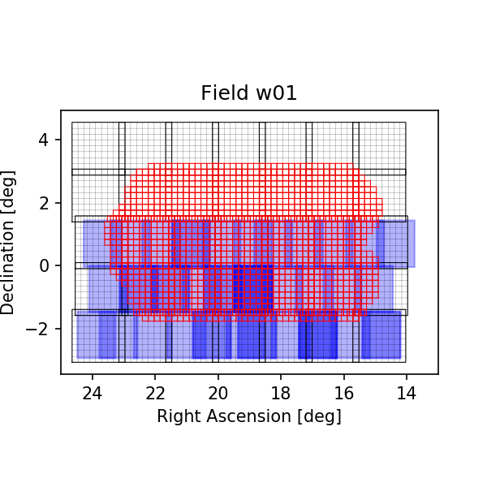

# VHS HSC Wide run

This is the first VHS field run alongside the HSC Wide survey data. There is some VHS overlap with all the sourthern HSC Wide fields w01-05. The generation 2 Butler runs are stored locally. The generation 3 runs will be stored in a single top level repository.

## Run details

### Prototype run April 2021 (P2021.1)

Currently underway.
