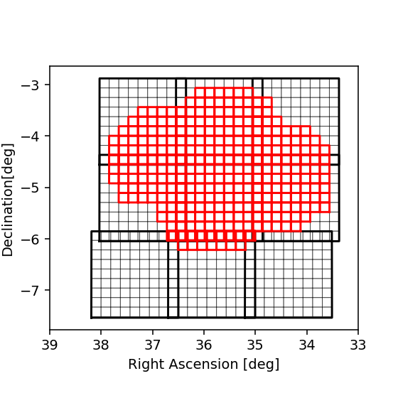

# SXDS HSC DUD and VISTA VIDEO catalogues

The SXDS field is covered by the VIDEO, VIKING, and VHS VISTA surveys in addition to the HyperSuprimeCam PDR2 Deep and Ultra Deep data. 
We therefore chose this field as a prototype field. 
We periodically run the full pipeline over all bands that cover the 219 pacthes with VIDEO imaging.
We also have SExtractor 'dual mode' VISTA-HSC catalogues on this field which we use as a baseline comparitor for the photometric and astrometric solution.

Please not that these are prototype catalogues. In addition to issues we hqve already found we anticipate further issues to continuously discovered.
We therefore ask that anybody using the catalogues take care especially when using the data to produce scientific results.

Figure 1. Red squares show HSC DUD patches, blue shows VIDEO patches.

## Data access

We are making the catalogues available on the VISTA Science Archive (VSA).

## Run details

### First prototype December 2020

We conducted the first run in December 2020. This version was only VISTA Ks band detected.
In that regard and some other crucial ways it differs from the later runs which are all band detected.
Later runs also had changes to the photometric reference catalogues and additional measurements included.

### Second prototype run April 2021

We conducted a full overlap run in April 2021. This will likely be the last run using the gen 2 Butler.
This run is all band selected and includes Kron, CModel, and convolved aperture fluxes.

