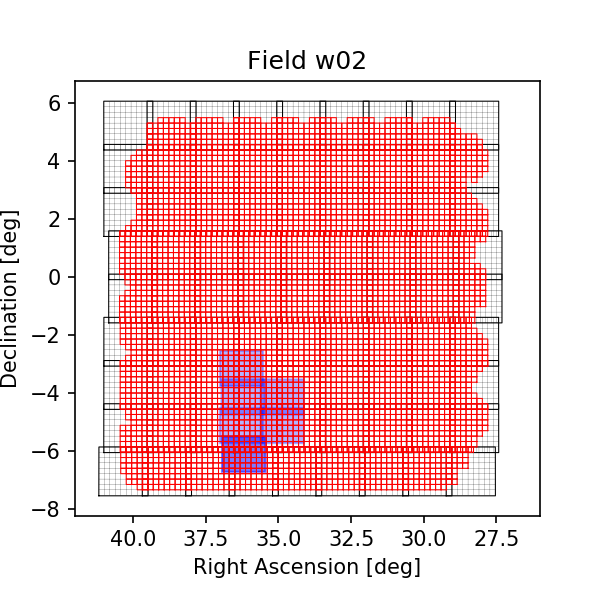
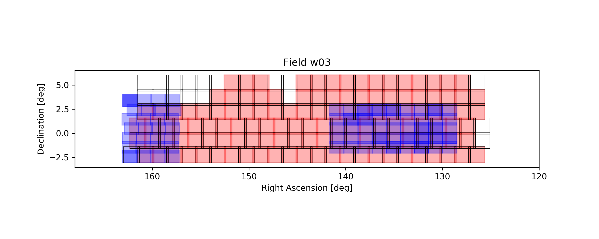
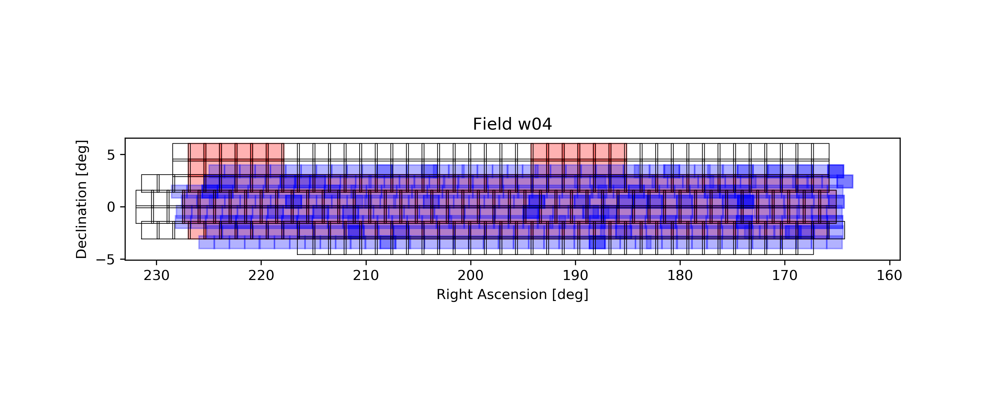

# VIKING HSC wide runs

The VISTA VIKING survey overlaps significatnly with the HSC PDR2 Wide runs in the fields w02, w03, and w04.

# Run details

### Second prototype run April 2021 (P2021.1)

This was the first full overlap run. It originally failed with a detection bug but was then immediately rerun. Details of the run can be read in the VIDEO folder. 

